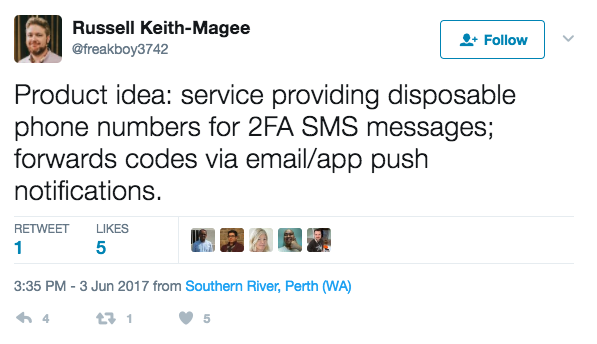

# SMS ➙ Push Proxy

Convert any SMS sent to a Nexmo virtual number into push notifications

## Requirements

- [Nexmo](https://nexmo.com) account, with a rented virtual number
- [Pushover account](https://pushover.net)
- [AWS account](https://aws.amazon.com/) and ability to create lambdas / API gateway

## Usage

- Create an API Gateway that has a POST action, this will be the trigger for our lambda function
- Download the latest zip file from the [releases page](https://github.com/aaronbassett/nexmo-lambda-pushover/releases)
- Upload the zip file as your lambda function
- Set the environment variables `PUSHOVER_USER_KEY` and `PUSHOVER_TOKEN` to the relevant keys from [your Pushover account](https://pushover.net/api)
- On the [Nexmo numbers](https://dashboard.nexmo.com/your-numbers) page edit your virtual number and set the Webhook URL to be your API gateway invoke URL, probably something like "https://<random letters>.execute-api.<region>.amazonaws.com/<stage>"
- ensure the HTTP method on your [Nexmo settings](https://dashboard.nexmo.com/settings) is set to `POST-JSON`
